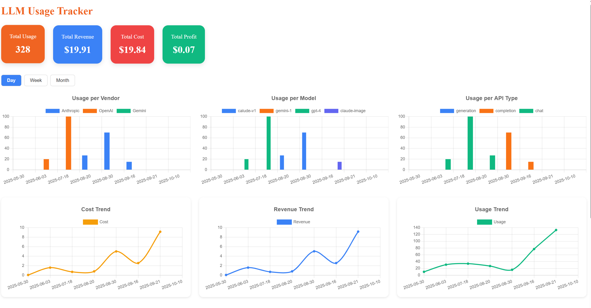
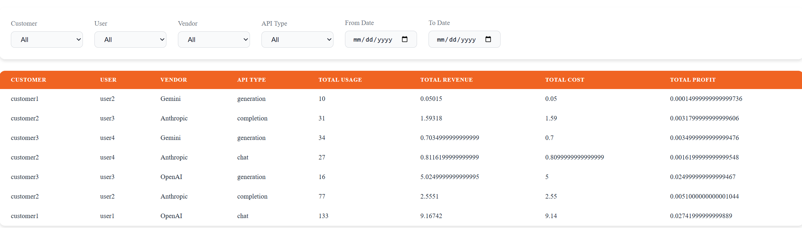

# LLM Usage Tracker Dashboard

The LLM Usage Tracker Dashboard provides a web interface to monitor and analyze usage metrics of large language model (LLM) APIs. Users can filter data by customer, user, vendor, API type, and date range to visualize trends in usage, cost, revenue, and profit. The dashboard includes interactive charts and tables for tracking performance across different vendors and models over time.

## How to run it

Make sure the API is run first, then run this command:

```bash
npm run dev
```

Access dashboard at `http://localhost:5173/`


